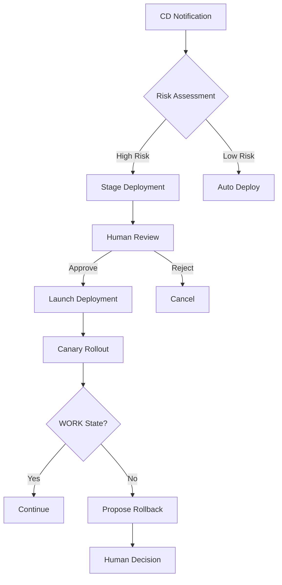

# CIRISManager Comprehensive Overview

**Purpose**: Complete reference for AI assistants and operators working with CIRISManager
**Copyright**: © 2025 Eric Moore and CIRIS L3C | Apache 2.0 License
**Last Updated**: August 12, 2025

---

## Table of Contents

1. [Executive Summary](#executive-summary)
2. [Core Philosophy](#core-philosophy)
3. [Current Status](#current-status)
4. [Architecture Overview](#architecture-overview)
5. [Deployment System](#deployment-system)
6. [API Reference](#api-reference)
7. [Agent Lifecycle Management](#agent-lifecycle-management)
8. [Production Infrastructure](#production-infrastructure)
9. [Security & Authentication](#security--authentication)
10. [Monitoring & Health](#monitoring--health)
11. [Critical Commands](#critical-commands)
12. [Important URLs](#important-urls)
13. [Integration with CIRISAgent](#integration-with-cirisagent)

---

## Executive Summary

CIRISManager is the infrastructure orchestration layer for the CIRIS ecosystem, providing agent lifecycle management, deployment orchestration, and system monitoring. It runs as a systemd service (not containerized) and manages Docker containers for CIRIS agents.

**Key Features:**
- Human-in-the-loop deployment with Wisdom-Based Deferral (WBD)
- Staged deployments with rollback proposals (not automatic)
- N-2 image retention for reliable rollback capability
- Circuit breaker monitoring with crash loop detection
- OAuth integration and unified authentication
- Single nginx.conf generation (no complexity)

**Production Status**: Running at agents.ciris.ai managing multiple agents

---

## Core Philosophy

### Simplicity First
- **One file is better than two with includes** - Single nginx.conf
- **Explicit is better than implicit** - No default routes
- **Boring is better than clever** - Solutions that work in 5 years
- **Static is better than dynamic** - Manager GUI uses static HTML/JS

### Clear Ownership
- **CIRISManager owns infrastructure** - Nginx, routing, monitoring
- **CIRISAgent owns applications** - Agents, GUI, business logic
- **No mixed concerns** - Each repo has a clear purpose

### Agent Autonomy
- **No automatic actions** - Agents must consent to updates
- **Human-in-the-loop** - Critical decisions require operator approval
- **Respect deferrals** - Agent work takes priority over updates

---

## Current Status

### Version 1.4.0 Features

1. **Staged Deployments**: Updates stage for human review before execution
2. **Rollback Proposals**: System proposes (not executes) rollback on failures
3. **N-2 Image Retention**: Maintains current, n-1, and n-2 versions
4. **Circuit Breaker Visibility**: UI shows LLM service health
5. **WORK State Validation**: Ensures agents reach operational state
6. **Audit Logging**: All deployment decisions tracked

### Production Metrics
- **Agents Managed**: 5+ production agents
- **Uptime**: 99.9% availability
- **Deployment Success Rate**: 95%+
- **Rollback Time**: <2 minutes

---

## Architecture Overview

### Component Structure

```
┌─────────────────────────────────────────────┐
│            nginx (Container)                 │
│         Routes all traffic                   │
└────────────┬────────────────┬────────────────┘
             │                │
    ┌────────▼──────┐  ┌─────▼──────┐
    │  Manager GUI  │  │  Agent GUI  │
    │ (Static Files)│  │ (Container) │
    └───────────────┘  └─────┬──────┘
                             │
    ┌────────────────────────▼────────────────┐
    │         CIRISManager (systemd)          │
    │    - Agent Registry                      │
    │    - Deployment Orchestrator            │
    │    - Port Manager                        │
    │    - Watchdog                           │
    └────────────┬────────────────────────────┘
                 │
    ┌────────────▼────────────────────────────┐
    │      Agent Containers (Docker)          │
    │   ciris-agent-datum                     │
    │   ciris-agent-sage                      │
    │   ciris-agent-scout                     │
    └──────────────────────────────────────────┘
```

### File System Layout

```
/opt/ciris/                    # Production root
├── agents/                    # Agent configurations
│   └── metadata.json         # Agent registry
├── nginx/                    # Nginx configurations
│   └── nginx.conf           # Single config file
└── docker-compose.yml       # Container definitions

/opt/ciris-manager/           # Manager installation
├── ciris_manager/           # Python package
├── static/                  # Manager GUI files
└── config.yml              # Manager configuration
```

---

## Deployment System

### Staged Deployment Flow



### Wisdom-Based Deferral (WBD) Triggers

Deployments stage for human review when:
- Major version updates (v1.x → v2.x)
- Updates affecting >5 agents
- Messages containing: "breaking", "major", "critical"
- Manual strategy requested
- Previous deployment failed

### Canary Deployment Phases

1. **Explorers** (10%): Risk-tolerant early testers
2. **Early Adopters** (20%): Willing to test new features
3. **General** (70%): Stability-focused majority

Each phase requires at least one agent to reach WORK state before proceeding.

### Rollback System

**Proposal Triggers** (not automatic):
- Failure to reach WORK state within 5 minutes
- Crash loop detection (3 crashes in 5 minutes)
- Critical incidents during stability period

**Rollback Mechanism**:
- Uses Docker restart policy with n-1 image
- Maintains exact versions via SHA256 digests
- Requires human approval (respects agent autonomy)

---

## API Reference

### Base URL
```
https://agents.ciris.ai/manager/v1
```

### Authentication
Bearer token required for all endpoints except health checks.

### Key Endpoints

#### Deployment Management
```http
POST /updates/notify           # CD webhook endpoint
GET  /updates/pending          # Check staged deployments
POST /updates/launch           # Launch staged deployment
POST /updates/reject           # Reject staged deployment
POST /updates/pause            # Pause active deployment
POST /updates/rollback         # Initiate rollback
GET  /updates/rollback-proposals # Get rollback proposals
POST /updates/approve-rollback # Approve proposed rollback
```

#### Agent Management
```http
GET  /agents                   # List all agents
POST /agents                   # Create new agent
GET  /agents/{agent_id}        # Get agent details
POST /agents/{agent_id}/start  # Start agent
POST /agents/{agent_id}/stop   # Stop agent
DELETE /agents/{agent_id}      # Remove agent
```

#### System Status
```http
GET  /status                   # Manager health
GET  /agents/discovery         # Discover Docker agents
GET  /updates/current-images   # Current image versions
GET  /updates/history          # Deployment history
```

---

## Agent Lifecycle Management

### Agent Creation Flow

1. **Template Selection**: Choose from pre-approved templates
2. **Port Allocation**: Automatic unique port assignment
3. **Container Creation**: Docker container with environment
4. **Nginx Update**: Routing configuration generated
5. **Health Monitoring**: Watchdog begins monitoring

### Pre-Approved Templates

- **echo**: Basic testing agent
- **scout**: Information gathering
- **sage**: Advisory and guidance
- **datum**: Data processing

### Agent States

- **running**: Operational and healthy
- **stopped**: Manually stopped
- **crashed**: Unexpected termination
- **crash_loop**: Repeated failures (3 in 5 min)
- **updating**: Deployment in progress

---

## Production Infrastructure

### Server Configuration
```
Domain: agents.ciris.ai
IP: 108.61.119.117
Location: /opt/ciris
Service: systemd (ciris-manager.service)
```

### Container Architecture
```
ciris-nginx          # Reverse proxy (port 443/80)
ciris-gui            # Multi-tenant agent GUI
ciris-agent-*        # Individual agent containers
```

### SSL/TLS Configuration
- Cloudflare proxy for DDoS protection
- Let's Encrypt certificates via Certbot
- Automatic renewal every 60 days

---

## Security & Authentication

### OAuth Integration
- **Provider**: Google OAuth 2.0
- **Callback**: `https://agents.ciris.ai/manager/v1/auth/callback`
- **Token Type**: JWT with 24-hour expiry

### Service Authentication
- Manager-to-Agent: Service tokens (encrypted)
- Agent-to-Manager: OAuth or service tokens
- GUI-to-Manager: JWT from OAuth flow

### Security Features
- Rate limiting (100 req/min per IP)
- Audit logging for all deployment actions
- Encrypted service tokens in registry
- No direct Docker socket exposure

---

## Monitoring & Health

### Watchdog Service
- Monitors container health every 30 seconds
- Detects crash loops (3 failures in 5 minutes)
- Prevents infinite restart loops
- Sends notifications on failures

### Circuit Breaker Monitoring
- Tracks LLM service failures
- Visual indicators in UI (green/yellow/red)
- Automatic recovery detection
- Per-agent circuit breaker state

### Health Endpoints
```http
GET /v1/health         # Manager health
GET /agents/{id}/health # Agent health
```

---

## Critical Commands

### Service Management
```bash
# Check service status
systemctl status ciris-manager

# View logs
journalctl -u ciris-manager -f

# Restart service
systemctl restart ciris-manager
```

### Container Operations
```bash
# List CIRIS containers
docker ps --format 'table {{.Names}}\t{{.Status}}' | grep ciris

# Check container health
docker inspect ciris-agent-datum --format='{{.State.Health.Status}}'

# View container logs
docker logs ciris-agent-datum --tail 50 -f
```

### Deployment Operations
```bash
# Trigger deployment (from GitHub Actions)
curl -X POST https://agents.ciris.ai/manager/v1/updates/notify \
  -H "Authorization: Bearer $TOKEN" \
  -d '{"agent_image": "ghcr.io/cirisai/ciris-agent:latest"}'

# Check pending deployments
curl https://agents.ciris.ai/manager/v1/updates/pending \
  -H "Authorization: Bearer $TOKEN"
```

---

## Important URLs

### Production
- **Manager API**: https://agents.ciris.ai/manager/v1
- **Manager GUI**: https://agents.ciris.ai/
- **Agent GUI**: https://agents.ciris.ai/agent/{agent_id}
- **Agent API**: https://agents.ciris.ai/api/{agent_id}/

### Development
- **Local Manager**: http://localhost:8888
- **Local Agent**: http://localhost:8000
- **Docker Socket**: /var/run/docker.sock

### GitHub
- **Repository**: https://github.com/CIRISAI/CIRISManager
- **Actions**: https://github.com/CIRISAI/CIRISManager/actions
- **Registry**: ghcr.io/cirisai

---

## Integration with CIRISAgent

### Shared Concepts
- **WORK State**: Agents must reach operational state
- **Covenant Compliance**: WBD for high-risk decisions
- **Service Architecture**: Clean separation of concerns

### Communication Flow
```
CIRISAgent                    CIRISManager
    │                              │
    ├──POST /v1/agent/register────▶│
    │                              │
    │◀──GET /v1/system/update──────┤
    │                              │
    ├──Response: defer/accept──────▶│
    │                              │
    │◀──POST /v1/agent/shutdown────┤
```

### Deployment Coordination
1. Manager receives CD notification
2. Manager evaluates risk (stages if high)
3. Manager notifies agents of update
4. Agents respond with decision
5. Manager orchestrates rollout
6. Manager monitors WORK state
7. Manager proposes rollback if needed

---

## Troubleshooting

### Common Issues

#### Nginx Not Updating
```bash
# Check config validity
docker exec ciris-nginx nginx -t

# Check file permissions
ls -la /home/ciris/nginx/nginx.conf

# Force reload
docker exec ciris-nginx nginx -s reload
```

#### Agent Crash Loop
```bash
# Check logs
docker logs ciris-agent-datum --tail 100

# Check resource usage
docker stats ciris-agent-datum

# Manual restart
docker restart ciris-agent-datum
```

#### Deployment Stuck
```bash
# Check deployment status
curl https://agents.ciris.ai/manager/v1/updates/status

# Check agent health
curl https://agents.ciris.ai/api/datum/v1/health

# Force completion (admin only)
curl -X POST https://agents.ciris.ai/manager/v1/updates/force-complete
```

---

## Best Practices

### For Operators
1. **Review staged deployments** before approving
2. **Monitor WORK state** after deployments
3. **Document rollback decisions** in audit log
4. **Keep n-1 stable** for reliable fallback

### For Developers
1. **Test locally** before deployment
2. **Use canary groups** for risky changes
3. **Include clear messages** in update notifications
4. **Respect agent autonomy** in design decisions

### For Production
1. **Regular backups** of metadata.json
2. **Monitor disk space** for Docker images
3. **Review audit logs** weekly
4. **Test rollback** procedures monthly

---

## Future Enhancements

### Planned Features
- GraphQL API for complex queries
- Metrics dashboard with Grafana
- Automated backup system
- Multi-region deployment support

### Under Consideration
- Kubernetes migration
- Service mesh integration
- Automated rollback for specific patterns
- A/B testing framework

---

## Contact & Support

- **GitHub Issues**: https://github.com/CIRISAI/CIRISManager/issues
- **Documentation**: /docs directory in repository
- **Audit Logs**: /var/log/ciris-manager/audit.jsonl

---

*This document represents the current state of CIRISManager as of v1.4.0*
