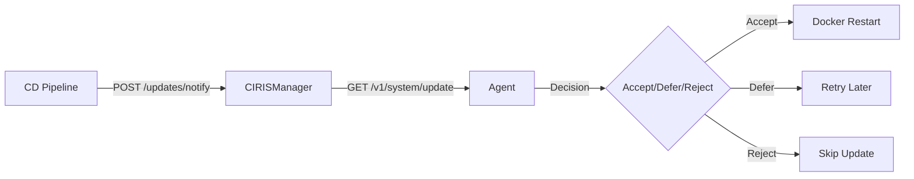

[](https://deepwiki.com/CIRISAI/CIRISManager)

# CIRISManager

Production-grade lifecycle management for CIRIS agents with automatic nginx routing, OAuth authentication, canary deployments, and comprehensive agent configuration management.

## Table of Contents

- [Features](#features)
- [Quick Start](#quick-start)
- [Installation](#installation)
- [Configuration](#configuration)
- [Agent Management](#agent-management)
- [Manager GUI](#manager-gui)
- [API Reference](#api-reference)
- [Authentication](#authentication)
- [Deployment](#deployment)
- [Architecture](#architecture)
- [Development](#development)
- [Troubleshooting](#troubleshooting)
- [Security](#security)
- [License](#license)

## Features

### Core Capabilities
- **Automatic Agent Discovery** - Detects and manages CIRIS agent containers via Docker
- **Dynamic Nginx Routing** - Generates and maintains nginx configurations for multi-tenant agent access
- **Crash Loop Detection** - Prevents infinite restarts with configurable thresholds (3 crashes in 5 minutes)
- **OAuth Authentication** - Secure access with Google OAuth and JWT tokens
- **Canary Deployments** - Orchestrates staged rollouts with agent consent
- **RESTful API** - Complete management interface for agents and system operations
- **File-based Logging** - Comprehensive logging with rotation to `/var/log/ciris-manager/`

### Enhanced Agent Management (New!)
- **Full Environment Variable Control** - Manage all agent environment variables through the GUI
- **Discord Integration Management** - Easy toggle and configuration of Discord adapter
- **Wise Authority (WA) Review** - Required approval process for Tier 4/5 agents
- **Template-based Stewardship** - Automatic tier detection from agent templates
- **Live Configuration Updates** - Modify agent settings without manual container restarts
- **.env File Support** - Import environment variables from .env files

## Quick Start

### Installation

```bash
# Clone repository
git clone https://github.com/CIRISAI/CIRISManager.git
cd CIRISManager

# Install with development dependencies
pip install -e ".[dev]"

# Generate default configuration
ciris-manager --generate-config --config /etc/ciris-manager/config.yml

# Start the service
ciris-manager --config /etc/ciris-manager/config.yml
```

### Basic Usage

```bash
# Authenticate
ciris-manager auth login your-email@ciris.ai

# List agents
ciris-manager agent list

# Create new agent
ciris-manager agent create --name "my-agent" --template scout

# Delete agent
ciris-manager agent delete agent-id

# Check system status
ciris-manager system status
```

## Installation

### System Requirements

- Python 3.11+
- Docker 20.10+
- nginx (via Docker container)
- systemd (for production deployment)
- 2GB RAM minimum
- 10GB disk space

### Production Installation

```bash
# Create system user
sudo useradd -r -s /bin/false ciris

# Create directories
sudo mkdir -p /opt/ciris-manager
sudo mkdir -p /etc/ciris-manager
sudo mkdir -p /var/log/ciris-manager
sudo mkdir -p /opt/ciris/agents

# Set permissions
sudo chown -R ciris:ciris /opt/ciris-manager
sudo chown -R ciris:ciris /etc/ciris-manager
sudo chown -R ciris:ciris /var/log/ciris-manager
sudo chown -R ciris:ciris /opt/ciris

# Install CIRISManager
cd /opt/ciris-manager
git clone https://github.com/CIRISAI/CIRISManager.git .
pip install -r requirements.txt

# Setup systemd service
sudo cp deployment/ciris-manager.service /etc/systemd/system/
sudo systemctl daemon-reload
sudo systemctl enable ciris-manager
sudo systemctl start ciris-manager
```

### Docker Compose Setup

```yaml
version: '3.8'

services:
  ciris-manager:
    image: ghcr.io/cirisai/ciris-manager:latest
    container_name: ciris-manager
    restart: unless-stopped
    ports:
      - "8888:8888"
    volumes:
      - /var/run/docker.sock:/var/run/docker.sock
      - /opt/ciris:/opt/ciris
      - /etc/ciris-manager:/etc/ciris-manager
    environment:
      - CIRIS_AUTH_MODE=production
      - GOOGLE_CLIENT_ID=${GOOGLE_CLIENT_ID}
      - GOOGLE_CLIENT_SECRET=${GOOGLE_CLIENT_SECRET}
      - MANAGER_JWT_SECRET=${MANAGER_JWT_SECRET}
      - CIRIS_DEPLOY_TOKEN=${CIRIS_DEPLOY_TOKEN}

  ciris-nginx:
    image: nginx:alpine
    container_name: ciris-nginx
    restart: unless-stopped
    ports:
      - "80:80"
      - "443:443"
    volumes:
      - /opt/ciris/nginx/nginx.conf:/etc/nginx/nginx.conf:ro
      - /opt/ciris/ssl:/etc/nginx/ssl:ro
      - /opt/ciris-manager/static:/usr/share/nginx/html/manager:ro
```

## Configuration

### Main Configuration File

Default configuration at `/etc/ciris-manager/config.yml`:

```yaml
# Manager settings
manager:
  host: 0.0.0.0
  port: 8888
  agents_directory: /opt/ciris/agents
  templates_directory: /opt/ciris-manager/agent_templates

# Authentication
auth:
  mode: production  # Options: production, development
  jwt_algorithm: HS256
  jwt_expiry_hours: 24
  allowed_domains:
    - "@ciris.ai"  # Restrict to domain

# OAuth configuration
oauth:
  google:
    enabled: true
    client_id: ${GOOGLE_CLIENT_ID}
    client_secret: ${GOOGLE_CLIENT_SECRET}
    redirect_uri: https://agents.ciris.ai/manager/v1/oauth/callback

# Nginx integration
nginx:
  enabled: true
  config_dir: /opt/ciris/nginx
  container_name: ciris-nginx
  ssl_cert: /etc/nginx/ssl/cert.pem
  ssl_key: /etc/nginx/ssl/key.pem

# Container monitoring
watchdog:
  enabled: true
  check_interval: 30  # seconds
  crash_threshold: 3   # crashes
  crash_window: 300    # seconds
  restart_delay: 10    # seconds between restart attempts

# Docker configuration
docker:
  compose_file: /opt/ciris/docker-compose.yml
  network: ciris-network

# Port allocation
port_manager:
  start_port: 8000
  end_port: 8999
  reserved_ports:
    - 8888  # Manager API
    - 8080  # GUI container

# Logging
logging:
  level: INFO
  file: /var/log/ciris-manager/manager.log
  max_size: 10485760  # 10MB
  backup_count: 5

# Deployment orchestration
deployment:
  strategies:
    canary:
      explorer_percentage: 10
      early_adopter_percentage: 20
      general_percentage: 70
      phase_delay: 300  # seconds between phases
    immediate:
      enabled: true
    manual:
      enabled: true
```

### Environment Variables

Create `/etc/ciris-manager/environment`:

```bash
# OAuth Credentials
GOOGLE_CLIENT_ID=your-client-id.apps.googleusercontent.com
GOOGLE_CLIENT_SECRET=your-client-secret

# Security
MANAGER_JWT_SECRET=generate-with-openssl-rand-hex-32
CIRIS_DEPLOY_TOKEN=your-deployment-token

# Optional: Override config values
CIRIS_AUTH_MODE=production
CIRIS_LOG_LEVEL=DEBUG
```

## Agent Management

### Creating Agents

#### Via Manager GUI

1. Navigate to https://agents.ciris.ai/manager/
2. Click "Create Agent"
3. Select template and configure:
   - Agent name
   - Environment variables
   - Discord settings (if applicable)
   - WA review confirmation (for Tier 4/5 agents)

#### Via CLI

```bash
# Basic agent creation
ciris-manager agent create --name "my-agent" --template scout

# With custom environment variables
ciris-manager agent create \
  --name "my-agent" \
  --template echo \
  --env OPENAI_API_KEY=sk-... \
  --env DISCORD_BOT_TOKEN=... \
  --env DISCORD_CHANNEL_IDS=123,456,789

# With .env file
ciris-manager agent create \
  --name "my-agent" \
  --template sage \
  --env-file /path/to/.env
```

#### Via Python SDK

```python
from ciris_manager.sdk import CIRISManagerClient

client = CIRISManagerClient(
    base_url="https://agents.ciris.ai",
    token="your-jwt-token"
)

# Create agent with full configuration
agent = client.create_agent(
    name="my-agent",
    template="echo",
    environment={
        "OPENAI_API_KEY": "sk-...",
        "DISCORD_BOT_TOKEN": "...",
        "DISCORD_CHANNEL_IDS": "123,456,789",
        "WA_USER_IDS": "user1,user2",
        "CIRIS_MOCK_LLM": "false"
    },
    wa_review_completed=True  # Required for Tier 4/5
)
```

### Agent Templates

Templates define agent configurations and stewardship tiers:

| Template | Description | Tier | WA Review Required |
|----------|-------------|------|--------------------|
| `scout` | Basic exploration agent | 2 | No |
| `sage` | Knowledge management | 2 | No |
| `datum` | Data processing | 3 | No |
| `echo` | Discord moderation | 4 | Yes |
| `echo-context` | Context-aware moderation | 4 | Yes |
| `echo-community` | Community management | 5 | Yes |

#### Template Structure

```yaml
# agent_templates/echo.yaml
name: Echo
description: Discord moderation agent
stewardship:
  stewardship_tier: 4
  requires_wa_review: true
identity:
  name: Echo
  role: Discord Moderator
environment:
  CIRIS_ADAPTER: api,discord
  DISCORD_BOT_TOKEN: ""
  DISCORD_CHANNEL_IDS: ""
  WA_USER_IDS: ""
  DISCORD_DEFERRAL_CHANNEL_ID: ""
```

### Managing Agent Settings

#### Enhanced Settings Modal

The Manager GUI provides comprehensive environment variable management:

1. **Quick Settings**
   - Mock LLM toggle (for testing without API costs)
   - Discord adapter enable/disable

2. **Discord Configuration** (shown when Discord is enabled)
   - Bot token
   - Monitored channel IDs (newline or comma-separated)
   - Deferral channel ID
   - Wise Authority user IDs

3. **API Configuration**
   - OpenAI API key
   - LLM provider selection
   - Custom API endpoints

4. **Advanced Settings**
   - All environment variables
   - Add/remove custom variables
   - Import from .env file

#### Updating Configuration

```bash
# CLI update
ciris-manager agent update agent-id \
  --env DISCORD_CHANNEL_IDS=111,222,333 \
  --env WA_USER_IDS=user1,user2,user3

# API update
curl -X PATCH https://agents.ciris.ai/manager/v1/agents/agent-id/config \
  -H "Authorization: Bearer $TOKEN" \
  -H "Content-Type: application/json" \
  -d '{
    "environment": {
      "DISCORD_CHANNEL_IDS": "111,222,333",
      "WA_USER_IDS": "user1,user2",
      "CIRIS_ENABLE_DISCORD": "true"
    }
  }'
```

### Wise Authority (WA) Review Process

For Tier 4 and 5 agents (Echo templates), WA review is mandatory:

1. **Detection**: Template stewardship tier is automatically detected
2. **Confirmation**: User must check "WA Review Completed" checkbox
3. **Logging**: Confirmation is logged for audit purposes
4. **Enforcement**: Agent creation fails without confirmation

```python
# Example WA review validation
if stewardship_tier >= 4:
    if not request.wa_review_completed:
        raise HTTPException(
            status_code=400,
            detail=f"WA review confirmation required for Tier {stewardship_tier} agent"
        )
    # Log the confirmation
    logger.info(f"WA review confirmed for Tier {stewardship_tier} agent '{name}'")
```

## Manager GUI

### Accessing the GUI

1. Navigate to https://agents.ciris.ai/manager/
2. Authenticate with Google OAuth (@ciris.ai domain required in production)
3. Access full management interface

### GUI Features

#### Agents Tab
- List all running agents with status
- Start/stop/restart controls
- Resource usage monitoring
- Quick access to agent settings
- OAuth setup wizard for new agents

#### Manager Status Tab
- Service health indicators
- Component status (Docker, nginx, watchdog)
- System resource usage
- Active connections

#### Versions Tab
- Current container versions
- Active deployment status
- Agent version adoption table
- Recent deployment history
- Version migration tracking

### Mobile Support

The Manager GUI is fully responsive with:
- Touch-optimized controls
- Card-based layouts for mobile
- Collapsible sections
- Swipe gestures for navigation

## API Reference

### Base URL
`https://agents.ciris.ai/manager/v1`

### Authentication
All endpoints require JWT token in Authorization header:
```
Authorization: Bearer <jwt-token>
```

### Agent Management Endpoints

#### List Agents
```http
GET /agents
```
Response:
```json
{
  "agents": [
    {
      "agent_id": "scout-1",
      "agent_name": "Scout Agent",
      "status": "running",
      "port": 8001,
      "version": "1.0.0",
      "template": "scout"
    }
  ]
}
```

#### Get Agent Configuration
```http
GET /agents/{agent_id}/config
```
Response:
```json
{
  "agent_id": "scout-1",
  "environment": {
    "OPENAI_API_KEY": "sk-...",
    "DISCORD_BOT_TOKEN": "...",
    "DISCORD_CHANNEL_IDS": "123,456,789"
  },
  "compose_file": "/opt/ciris/agents/scout-1/docker-compose.yml"
}
```

#### Update Agent Configuration
```http
PATCH /agents/{agent_id}/config
```
Request:
```json
{
  "environment": {
    "DISCORD_CHANNEL_IDS": "111,222,333",
    "CIRIS_ENABLE_DISCORD": "true"
  }
}
```

#### Create Agent
```http
POST /agents
```
Request:
```json
{
  "name": "my-agent",
  "template": "echo",
  "environment": {
    "OPENAI_API_KEY": "sk-..."
  },
  "wa_review_completed": true
}
```

#### Delete Agent
```http
DELETE /agents/{agent_id}
```

### Template Endpoints

#### List Templates
```http
GET /templates
```
Response:
```json
{
  "templates": {
    "scout": "Scout agent template",
    "echo": "Echo moderation agent template"
  },
  "pre_approved": ["scout", "sage"]
}
```

#### Get Template Details
```http
GET /templates/{template_name}/details
```
Response:
```json
{
  "name": "echo",
  "description": "Discord moderation agent",
  "stewardship_tier": 4,
  "requires_wa_review": true
}
```

### System Endpoints

#### Health Check
```http
GET /health
```

#### Manager Status
```http
GET /status
```

#### Get Default Environment Variables
```http
GET /env/default
```

### OAuth Endpoints

#### Start OAuth Flow
```http
GET /oauth/login
```

#### OAuth Callback
```http
GET /oauth/callback?code={code}&state={state}
```

#### Get Current User
```http
GET /auth/user
```

### Deployment Endpoints (Protected)

#### Notify Update
```http
POST /updates/notify
Authorization: Bearer {DEPLOY_TOKEN}
```
Request:
```json
{
  "agent_image": "ghcr.io/cirisai/ciris-agent:latest",
  "gui_image": "ghcr.io/cirisai/ciris-gui:latest",
  "message": "Security update",
  "strategy": "canary"
}
```

#### Get Deployment Status
```http
GET /updates/status?deployment_id={id}
Authorization: Bearer {DEPLOY_TOKEN}
```

## Authentication

### OAuth Setup

#### Google Cloud Console Configuration

1. Create OAuth 2.0 Client ID
2. Configure authorized redirect URIs:
   - `https://agents.ciris.ai/manager/v1/oauth/callback`
   - `https://localhost:8888/manager/v1/oauth/callback` (development)
3. Enable required APIs:
   - Google+ API
   - People API
4. Configure OAuth consent screen

#### Device Flow (CLI)

The CLI uses OAuth device flow for authentication:

```bash
# Initiate login
ciris-manager auth login your-email@ciris.ai

# Output:
# Please visit: https://www.google.com/device
# Enter code: ABCD-EFGH
# Waiting for authorization...
# Successfully authenticated as your-email@ciris.ai
```

#### Web Flow (GUI)

1. Click login button
2. Redirect to Google OAuth
3. Authorize application
4. Redirect back with token
5. Token stored in localStorage

### JWT Tokens

#### Token Structure
```json
{
  "sub": "user@ciris.ai",
  "email": "user@ciris.ai",
  "name": "User Name",
  "picture": "https://...",
  "iat": 1234567890,
  "exp": 1234567890
}
```

#### Token Management
```python
# Generate token
from ciris_manager.api.auth_service import AuthService

auth = AuthService(config)
token = auth.create_token(user_info)

# Verify token
user = auth.verify_token(token)
```

## Deployment

### Production Deployment with Systemd

#### Service Configuration

Create `/etc/systemd/system/ciris-manager.service`:

```ini
[Unit]
Description=CIRIS Manager Service
After=network.target docker.service
Requires=docker.service

[Service]
Type=simple
User=ciris
Group=ciris
WorkingDirectory=/opt/ciris-manager
Environment="PATH=/usr/local/bin:/usr/bin:/bin"
Environment="PYTHONUNBUFFERED=1"
ExecStart=/usr/local/bin/ciris-manager --config /etc/ciris-manager/config.yml
Restart=always
RestartSec=10
StandardOutput=journal
StandardError=journal

[Install]
WantedBy=multi-user.target
```

#### Service Management

```bash
# Enable and start
sudo systemctl enable ciris-manager
sudo systemctl start ciris-manager

# Check status
sudo systemctl status ciris-manager

# View logs
sudo journalctl -u ciris-manager -f

# Restart
sudo systemctl restart ciris-manager
```

### CI/CD Integration

#### GitHub Actions Workflow

```yaml
name: Deploy CIRISManager

on:
  push:
    branches: [main]

jobs:
  deploy:
    runs-on: ubuntu-latest
    steps:
      - uses: actions/checkout@v4

      - name: Build and push Docker image
        run: |
          docker build -t ghcr.io/cirisai/ciris-manager:latest .
          docker push ghcr.io/cirisai/ciris-manager:latest

      - name: Deploy to production
        run: |
          ssh deploy@agents.ciris.ai "
            cd /opt/ciris-manager
            git pull
            pip install -r requirements.txt
            sudo systemctl restart ciris-manager
          "

      - name: Notify deployment
        run: |
          curl -X POST https://agents.ciris.ai/manager/v1/updates/notify \
            -H "Authorization: Bearer ${{ secrets.DEPLOY_TOKEN }}" \
            -d '{
              "agent_image": "ghcr.io/cirisai/ciris-agent:latest",
              "message": "Deployment successful"
            }'
```

### Canary Deployment Strategy

CIRISManager orchestrates phased rollouts:

1. **Phase 1: Explorers (10%)**
   - Early adopters receive update
   - Monitor for issues
   - 5-minute observation period

2. **Phase 2: Early Adopters (20%)**
   - Expanded test group
   - Validate stability
   - 5-minute observation period

3. **Phase 3: General (70%)**
   - Majority rollout
   - Complete deployment

#### Agent Update Flow



## Architecture

### System Architecture

```
┌─────────────────┐     ┌──────────────┐     ┌─────────────────┐
│   Cloudflare    │────▶│    Nginx     │────▶│  CIRISManager   │
│      CDN        │     │   Container   │     │    Service      │
└─────────────────┘     └──────────────┘     └─────────────────┘
                               │                      │
                               ▼                      ▼
                        ┌──────────────┐     ┌─────────────────┐
                        │  Agent GUI   │     │     Docker      │
                        │  Container   │     │     Daemon      │
                        └──────────────┘     └─────────────────┘
                               │                      │
                               ▼                      ▼
                        ┌──────────────────────────────┐
                        │      Agent Containers        │
                        │  (scout, echo, sage, etc.)   │
                        └──────────────────────────────┘
```

### Directory Structure

```
/opt/ciris-manager/
├── ciris_manager/           # Python package
│   ├── api/                 # API routes and auth
│   ├── core/                # Core functionality
│   ├── config/              # Configuration management
│   └── templates/           # Agent templates
├── static/                  # Manager GUI files
│   └── manager/
│       ├── index.html       # Main GUI
│       └── manager.js       # JavaScript logic
├── agent_templates/         # Agent YAML templates
├── deployment/              # Deployment scripts
└── tests/                   # Test suite

/opt/ciris/
├── agents/                  # Agent data directories
│   └── {agent-id}/
│       ├── docker-compose.yml
│       └── data/
├── nginx/                   # Nginx configurations
│   └── nginx.conf
└── metadata.json           # Agent registry

/etc/ciris-manager/
├── config.yml              # Main configuration
└── environment             # Environment variables

/var/log/ciris-manager/
├── manager.log             # Main service log
├── nginx-updates.log       # Nginx update log
└── deployment.log          # Deployment orchestration log
```

### Nginx Routing Architecture

#### Route Structure
```nginx
# Manager GUI (static files)
location / {
    root /usr/share/nginx/html/manager;
}

# Manager API
location /manager/v1/ {
    proxy_pass http://localhost:8888/manager/v1/;
}

# Agent GUI (multi-tenant)
location ~ ^/agent/([^/]+)/(.*)$ {
    proxy_pass http://ciris-gui:3000/$2?agent=$1;
}

# Agent APIs (dynamic routing)
location ~ ^/api/([^/]+)/(.*)$ {
    set $agent_id $1;
    set $path $2;
    proxy_pass http://ciris-agent-$agent_id:8080/v1/$path;
}
```

#### Key Implementation Details

1. **In-place Configuration Updates**
   - Preserves Docker bind mount inode
   - No service interruption
   - Atomic reload with validation

2. **WebSocket Support**
   ```nginx
   proxy_http_version 1.1;
   proxy_set_header Upgrade $http_upgrade;
   proxy_set_header Connection "upgrade";
   ```

3. **Security Headers**
   ```nginx
   add_header X-Frame-Options "SAMEORIGIN";
   add_header X-Content-Type-Options "nosniff";
   add_header X-XSS-Protection "1; mode=block";
   ```

## Development

### Development Setup

```bash
# Clone repository
git clone https://github.com/CIRISAI/CIRISManager.git
cd CIRISManager

# Create virtual environment
python -m venv venv
source venv/bin/activate  # or venv\Scripts\activate on Windows

# Install in development mode
pip install -e ".[dev]"

# Install pre-commit hooks
pre-commit install

# Run in development mode
export CIRIS_AUTH_MODE=development
ciris-manager --config config.dev.yml
```

### Running Tests

```bash
# Run all tests
pytest tests/

# Run with coverage
pytest --cov=ciris_manager tests/

# Run specific test file
pytest tests/ciris_manager/test_enhanced_settings.py

# Run with verbose output
pytest -v tests/
```

### Code Quality

```bash
# Format code
ruff format ciris_manager/ tests/

# Run linter
ruff check ciris_manager/ tests/

# Type checking
mypy ciris_manager/

# Run all pre-commit hooks
pre-commit run --all-files
```

### Building Docker Image

```dockerfile
FROM python:3.11-slim

WORKDIR /app

# Install system dependencies
RUN apt-get update && apt-get install -y \
    curl \
    && rm -rf /var/lib/apt/lists/*

# Copy requirements
COPY requirements.txt .
RUN pip install --no-cache-dir -r requirements.txt

# Copy application
COPY ciris_manager/ ./ciris_manager/
COPY static/ ./static/
COPY agent_templates/ ./agent_templates/

# Create non-root user
RUN useradd -m -u 1000 ciris && chown -R ciris:ciris /app
USER ciris

# Health check
HEALTHCHECK --interval=30s --timeout=3s --start-period=5s --retries=3 \
  CMD curl -f http://localhost:8888/manager/v1/health || exit 1

# Start service
CMD ["python", "-m", "ciris_manager", "--config", "/etc/ciris-manager/config.yml"]
```

## Troubleshooting

### Common Issues and Solutions

#### Nginx Routes Not Updating

**Problem**: Changes to agent configuration don't reflect in nginx routing

**Solutions**:
```bash
# Verify configuration was written
cat /opt/ciris/nginx/nginx.conf | grep -A5 "location.*api"

# Check nginx container can see the config
docker exec ciris-nginx cat /etc/nginx/nginx.conf | head -20

# Test nginx configuration
docker exec ciris-nginx nginx -t

# Force reload
docker exec ciris-nginx nginx -s reload

# If still not working, restart container
docker restart ciris-nginx
```

#### Agent API Returns 404

**Problem**: API calls to agents return 404 errors

**Solutions**:
```bash
# Check correct URL format (no /v1/ prefix for multi-tenant)
# Correct:
curl https://agents.ciris.ai/api/agent-id/agent/interact

# Wrong:
curl https://agents.ciris.ai/api/agent-id/v1/agent/interact

# Verify agent is running
docker ps | grep ciris-agent

# Check agent health
curl http://localhost:{agent-port}/v1/system/health
```

#### OAuth Authentication Fails

**Problem**: Unable to authenticate with Google OAuth

**Solutions**:
```bash
# Verify environment variables
cat /etc/ciris-manager/environment

# Check redirect URI matches Google Console
# Should be: https://your-domain/manager/v1/oauth/callback

# Test OAuth endpoint
curl https://agents.ciris.ai/manager/v1/oauth/login

# Check JWT secret is set
echo $MANAGER_JWT_SECRET

# View auth logs
grep -i auth /var/log/ciris-manager/manager.log
```

#### Agent Creation Fails

**Problem**: Cannot create new agents

**Solutions**:
```bash
# Check available ports
ciris-manager port list

# Verify Docker permissions
docker ps

# Check template exists
ls /opt/ciris-manager/agent_templates/

# View creation logs
tail -f /var/log/ciris-manager/manager.log

# Test with mock LLM first
ciris-manager agent create --name test --template scout --mock-llm
```

#### Container Crash Loops

**Problem**: Agent containers continuously restart

**Solutions**:
```bash
# Check crash detection
grep -i crash /var/log/ciris-manager/manager.log

# View container logs
docker logs ciris-agent-{id} --tail 50

# Check resource limits
docker stats ciris-agent-{id}

# Manually stop crash loop
docker stop ciris-agent-{id}

# Adjust crash threshold in config
# watchdog.crash_threshold: 5
```

### Diagnostic Commands

```bash
# Service health check
curl -s https://agents.ciris.ai/manager/v1/health | jq

# Manager status
ciris-manager system status

# Agent discovery
ciris-manager agent discover

# Port allocation
ciris-manager port list

# Template validation
ciris-manager template validate

# Configuration check
ciris-manager config validate

# View all logs
journalctl -u ciris-manager --since "1 hour ago"

# Check disk usage
df -h /opt/ciris /var/log/ciris-manager

# Monitor resource usage
htop -p $(pgrep -f ciris-manager)
```

### Log Files

| Log File | Purpose | Location |
|----------|---------|----------|
| `manager.log` | Main service log | `/var/log/ciris-manager/manager.log` |
| `nginx-updates.log` | Nginx configuration updates | `/var/log/ciris-manager/nginx-updates.log` |
| `deployment.log` | CD orchestration | `/var/log/ciris-manager/deployment.log` |
| `auth.log` | Authentication events | `/var/log/ciris-manager/auth.log` |
| `watchdog.log` | Container monitoring | `/var/log/ciris-manager/watchdog.log` |

## Security

### Security Features

1. **OAuth 2.0 Authentication**
   - Google OAuth integration
   - Domain restriction (@ciris.ai)
   - JWT token validation

2. **Role-Based Access Control**
   - OBSERVER: Read-only access
   - ADMIN: Full agent management
   - SYSTEM_ADMIN: System configuration

3. **Network Security**
   - TLS/SSL termination at nginx
   - Network isolation between agents
   - Docker socket protection

4. **Deployment Security**
   - Protected deployment endpoints
   - Deployment token validation
   - Audit logging

5. **Agent Security**
   - WA review for high-tier agents
   - Environment variable encryption
   - Secure configuration storage

### Security Best Practices

1. **Use Strong Secrets**
   ```bash
   # Generate JWT secret
   openssl rand -hex 32

   # Generate deployment token
   uuidgen | sha256sum | cut -d' ' -f1
   ```

2. **Restrict Network Access**
   ```yaml
   # docker-compose.yml
   networks:
     ciris-network:
       driver: bridge
       internal: true
   ```

3. **Enable Audit Logging**
   ```yaml
   # config.yml
   audit:
     enabled: true
     log_file: /var/log/ciris-manager/audit.log
     events:
       - agent_created
       - agent_deleted
       - config_updated
       - wa_review_confirmed
   ```

4. **Regular Updates**
   ```bash
   # Update CIRISManager
   cd /opt/ciris-manager
   git pull
   pip install -r requirements.txt
   sudo systemctl restart ciris-manager

   # Update containers
   docker-compose pull
   docker-compose up -d
   ```

5. **Backup Configuration**
   ```bash
   # Backup script
   #!/bin/bash
   BACKUP_DIR="/backup/ciris-manager/$(date +%Y%m%d)"
   mkdir -p $BACKUP_DIR

   # Backup configurations
   cp -r /etc/ciris-manager $BACKUP_DIR/
   cp -r /opt/ciris/agents $BACKUP_DIR/

   # Backup agent registry
   cp /opt/ciris/metadata.json $BACKUP_DIR/

   # Compress
   tar -czf $BACKUP_DIR.tar.gz $BACKUP_DIR
   rm -rf $BACKUP_DIR
   ```

## Contributing

We welcome contributions! Please see [CONTRIBUTING.md](CONTRIBUTING.md) for guidelines.

### Development Workflow

1. Fork the repository
2. Create a feature branch
3. Make your changes
4. Add tests
5. Run pre-commit hooks
6. Submit a pull request

### Code Standards

- Python 3.11+ type hints
- Black formatting
- Ruff linting
- 80% test coverage minimum
- Comprehensive docstrings

## Support

### Getting Help

- **Documentation**: https://docs.ciris.ai/manager
- **Issues**: https://github.com/CIRISAI/CIRISManager/issues
- **Discussions**: https://github.com/CIRISAI/CIRISManager/discussions
- **Email**: support@ciris.ai

### Reporting Issues

When reporting issues, please include:
- CIRISManager version
- Python version
- Docker version
- Configuration (sanitized)
- Error logs
- Steps to reproduce

## License

Apache 2.0 - See [LICENSE](LICENSE) file for details.

## Acknowledgments

CIRISManager is built with:
- FastAPI for the REST API
- Docker SDK for container management
- nginx for reverse proxy
- Google OAuth for authentication
- Pydantic for data validation
- pytest for testing

---

**Version**: 2.0.0
**Last Updated**: August 2025
**Maintainers**: CIRIS AI Team
